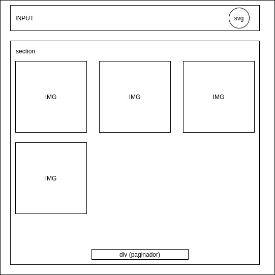
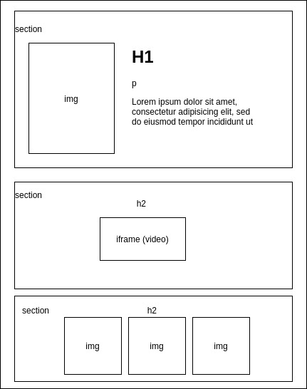

# ECOMSUR Prueba tecnica 

Esta es mi prueba tecnica para el proceso de seleccion en Ecomsur para el cargo de “Frontend Developer”

## Contenido
La APP contiene un listado de peliculas que podemos filtrar por nombre en un buscador, ademas brinda la informacion detallada de estas mismas, el trailer y peliculas relacionadas con la busqueda en otra pagina.


## Antes de codificar

Para empezar,me tome el tiempo de leer y entender todo lo que me pedian realizar, seguido a esto cree un diseño simple en Draw.io para tener una idea de como empezar a crear mi proyecto, me apoye de ideas en Pinterest, busque una paleta de colores y una vez definido todo esto ya estaba lista para empezar.


### Diagramas y estilo del proyecto





### Estructura de carpetas 

Cree el proyecto con el nombre Ecomsur y una vez creado, añadi las carpetas que necesitaba para organizar el codigo y entenderlo mejor.
Para esto se creo la siguiente estructura: 

```
src
└───assets --> Todos los recursos png o svg.    
│
└───constants --> Las  constantes que seran usadas por mas de un componente
│
└───pages --> Las paginas en las cuales navegara el usuario
│   └───home --> Todo lo relacionado con el componente home
│   └───detail-movie --> Todo lo relacionado con el componente detail-movie
└───services --> las funciones que llamen a la API
    │
    │   
```
## Librerias

- react-router-dom --> para la navegacion 
- react-paginate --> para la paginacion
- Firebase --> para el deploy
- Axios --> para hacer los request

## Codificando 

Se empezo creando la estructura HTML con el CSS del Home y el del detalle de la pelicula para la version Desktop, no se empezo por movil primero ya que el diseño inicial no contaba contaba con este. 

Una vez terminada la maquetacion, inicie con la implementacion de las funciones que llamarian a la API, y se empezo su implementacion primero en el Home y luego en el detalle de la pelicula. 

Por ultimo, se agrego la funcionalidad del filtro al campo de texto, a las imagenes del home que llevan al detalle y que el paginador actualizara la vista.
